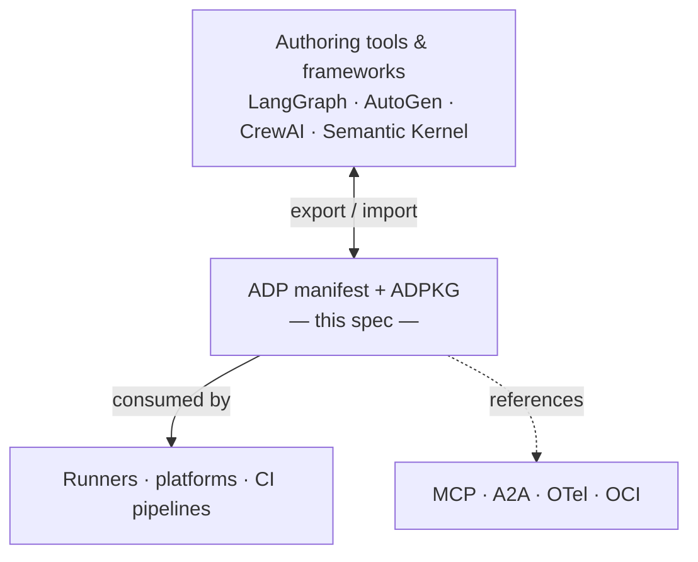

# Agent Definition Protocol (ADP)

[](https://github.com/casabre/agent-definition-protocol/actions/workflows/ci.yml)
[](https://codecov.io/gh/casabre/agent-definition-protocol)
[](https://github.com/casabre/agent-definition-protocol/releases)
[](LICENSE)
[](sdk/python)
[](sdk/typescript)
[](sdk/rust)
[](sdk/go)


---

Agent definitions live inside framework code. That works fine until you need to move an agent — different team, different environment, different framework. At that point you're reading framework internals to answer questions that should be trivial: what model does it use, what does it call, how do I know if it's working.

ADP is a manifest format for AI agents. You describe the agent once in YAML — runtime, flow, evaluation — and any conformant runner can pick it up. Think of it the way you think of OpenAPI: not a runtime, a description that runtimes agree to read.

> ADP is a **specification**, not a runtime or framework.

---

## What a manifest looks like

```yaml
adp_version: "0.1.0"
id: "agent.acme.analytics"
conformance_class: "full"

runtime:
  execution:
    - { id: "python-backend", backend: "python", entrypoint: "acme_agents.main:app" }
  models:
    - { id: "gpt4", provider: "openai", model: "gpt-4o" }

flow:
  id: "agent.acme.analytics.flow"
  graph:
    nodes:
      - { id: "ingest",  kind: "input"  }
      - { id: "analyze", kind: "llm",    model_ref: "gpt4" }
      - { id: "report",  kind: "output", output_ref: "context.analyze.content" }
    edges:
      - { from: "ingest",  to: "analyze" }
      - { from: "analyze", to: "report"  }
    start_nodes: ["ingest"]
    end_nodes:   ["report"]

evaluation:
  suites:
    - id: "accuracy"
      metrics:
        - { id: "factuality", type: "llm_judge", threshold: 0.85 }
```

---

## Framework support

The flow graph maps to the native concepts of each framework. You describe what the agent is already doing, not how each framework thinks:

| ADP concept | LangGraph | AutoGen | Semantic Kernel | CrewAI |
|---|---|---|---|---|
| `flow.graph.nodes[]` | `StateGraph.add_node` | `ConversableAgent` | `KernelProcessStep` | `@listen` method |
| conditional edge | `add_conditional_edges` | `GroupChatManager` | `OnEvent` | `@router` |
| `start_nodes[]` | `set_entry_point` | first `initiate_chat` | process entry | `@start` |
| `state.context[node.id]` | TypedDict `context` field | `chat_messages` | step output | flow state |
| `node.model_ref` | `ChatOpenAI(model=...)` | `llm_config` | `OpenAIChatCompletion` | task LLM |

Full mapping guides and a runnable LangGraph round-trip example: [`spec/framework-interop.md`](spec/framework-interop.md) and [`examples/runners/langgraph/`](examples/runners/langgraph/).

---

## Getting started

```bash
# Validate all schemas and run the conformance harness
PYTHON_BIN=python3 bash scripts/validate.sh
```

```python
from adp_sdk.adp_model import ADP
from adp_sdk.validation import validate_adp, validate_adp_semantics

adp = ADP.from_file("examples/acme-analytics/adp/agent.yaml")
validate_adp(adp)            # schema + conformance_class enforcement
validate_adp_semantics(adp)  # cross-ref check: edges, model_ref, runtime_ref
```

```bash
# LangGraph round-trip integration tests
cd examples/runners/langgraph
pip install -r requirements.txt && pip install -e ../../../sdk/python
pytest -v
```

---

## Where it fits



ADP references existing protocols rather than replacing them. MCP handles tool transport, A2A handles agent-to-agent calls, OCI handles packaging. ADP is the manifest that says which of those an agent uses and how.

---

## What's in this repo

| Component | Description | Location |
|---|---|---|
| **ADP spec** | Identity, runtime, flow, evaluation, governance | [`spec/adp-v0.1.0.md`](spec/adp-v0.1.0.md) |
| **Execution Semantics (ESP)** | Per-node state rules (D1–D7), condition expressions | [`spec/esp.md`](spec/esp.md) |
| **Runtime-flow binding** | Backend selection, `runtime_ref` resolution | [`spec/runtime-flow-binding.md`](spec/runtime-flow-binding.md) |
| **Framework interop guide** | LangGraph / AutoGen / SK / CrewAI mapping | [`spec/framework-interop.md`](spec/framework-interop.md) |
| **JSON Schemas** | 6 schemas, hosted on GitHub Pages | [`schemas/`](schemas/) |
| **SDKs** | validate / pack / unpack — Python · TS · Rust · Go | [`sdk/`](sdk/) |
| **Conformance harness** | 7 runner scenarios, CI dry-run mode | [`scripts/esp-runner-harness.py`](scripts/esp-runner-harness.py) |
| **LangGraph example** | ADP ↔ LangGraph round-trip pytest suite | [`examples/runners/langgraph/`](examples/runners/langgraph/) |
| **OCI packaging** | Pack agents into OCI artifacts | [`spec/adpkg-oci.md`](spec/adpkg-oci.md) |

---

## Navigation

| | |
|---|---|
| Spec entry point | [`spec/adp-v0.1.0.md`](spec/adp-v0.1.0.md) |
| Spec index | [`spec/README.md`](spec/README.md) |
| Roadmap | [`roadmap.md`](roadmap.md) |
| Examples | [`examples/`](examples/) |
| Conformance | [`spec/conformance.md`](spec/conformance.md) |
| Changelog | [`CHANGELOG.md`](CHANGELOG.md) |

---

## Contributing

Contributions welcome — [`CONTRIBUTING.md`](CONTRIBUTING.md) · [`GOVERNANCE.md`](GOVERNANCE.md) · [`CODE_OF_CONDUCT.md`](CODE_OF_CONDUCT.md)
