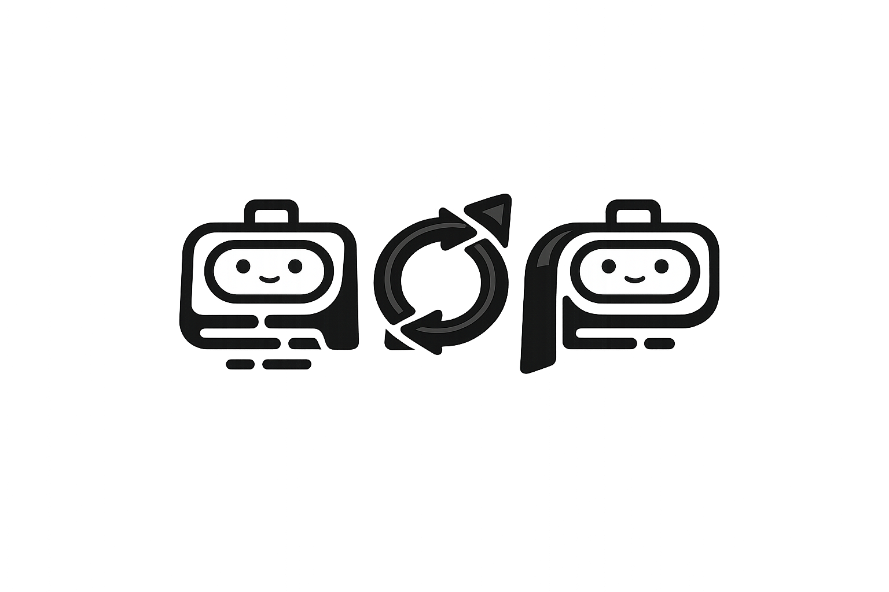
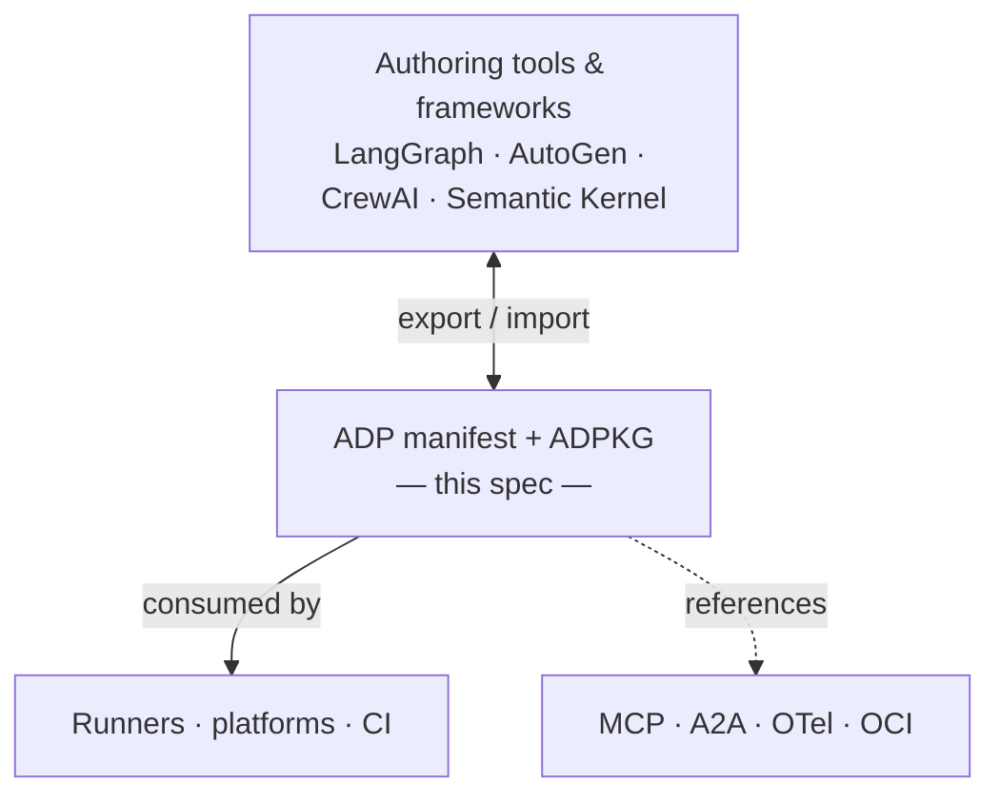

# Agent Definition Protocol (ADP)

[](https://github.com/casabre/agent-definition-protocol/actions/workflows/ci.yml)
[](https://codecov.io/gh/casabre/agent-definition-protocol)
[](https://github.com/casabre/agent-definition-protocol/releases)
[](LICENSE)
[](sdk/python)
[](sdk/typescript)
[](sdk/rust)
[](sdk/go)



---

You built an agent in LangGraph. It works. Now someone asks: "Can we run this in production? Can we evaluate it in CI? Can the other team use it with AutoGen?"

Suddenly you're digging through framework internals to answer basic questions — what model does it use, what tools, how is it evaluated, how do I package it for the registry.

**ADP is the OpenAPI for AI agents.** One YAML manifest declares your agent's runtime, flow graph, evaluation criteria, and packaging metadata. Frameworks and runners consume it. You move the agent without rewriting glue.

More precisely: ADP provides the **agent harness** — the portable, framework-neutral scaffolding that wraps an agent for execution, testing, and observation. Declare once, run anywhere.

> ADP is a specification, not a runtime. It declares the harness; your framework implements it.

### The four harness layers

| Layer | ADP fields | What it provides |
|---|---|---|
| **Execution** | `runtime`, `pipeline`, `streaming` | How the agent runs, processes I/O, and streams |
| **Observation** | `telemetry`, `hooks` | What can be seen during execution |
| **Safety** | `guardrails` | What is permitted to pass through |
| **Testing** | `x_testing` | How the agent is tested in isolation |

---

## What it looks like

```yaml
adp_version: "0.3.0"
id: "agent.acme.analytics"
conformance_class: "full"

runtime:
  execution:
    - { id: "python-backend", backend: "python", entrypoint: "acme_agents.main:app" }
  models:
    - { id: "gpt4", provider: "openai", model: "gpt-4o" }

flow:
  id: "agent.acme.analytics.flow"
  graph:
    nodes:
      - { id: "ingest",  kind: "input"  }
      - { id: "analyze", kind: "llm",    model_ref: "gpt4" }
      - { id: "report",  kind: "output", output_ref: "context.analyze.content" }
    edges:
      - { from: "ingest",  to: "analyze" }
      - { from: "analyze", to: "report"  }
    start_nodes: ["ingest"]
    end_nodes:   ["report"]

evaluation:
  suites:
    - id: "accuracy"
      metrics:
        - { id: "factuality", type: "llm_judge", threshold: 0.85 }
```

Validate it, pack it to OCI, hand it to any conformant runner — same manifest, any framework.

---

## Framework support

ADP's flow graph maps directly to each framework's native model:

| ADP concept | LangGraph | AutoGen | Semantic Kernel | CrewAI |
|---|---|---|---|---|
| `flow.graph.nodes[]` | `StateGraph.add_node` | `ConversableAgent` | `KernelProcessStep` | `@listen` |
| conditional edge | `add_conditional_edges` | `GroupChatManager` | `OnEvent` | `@router` |
| `start_nodes[]` | `set_entry_point` | first `initiate_chat` | process entry | `@start` |
| `state.context[node.id]` | TypedDict `context` field | `chat_messages` | step output | flow state |
| `node.model_ref` | `ChatOpenAI(model=...)` | `llm_config` | `OpenAIChatCompletion` | task LLM |

Full mapping guides and a runnable LangGraph example: [`spec/framework-interop.md`](spec/framework-interop.md) · [`examples/runners/langgraph/`](examples/runners/langgraph/)

---

## Get started

```bash
PYTHON_BIN=python3 bash scripts/validate.sh   # validate all schemas + conformance harness
```

```python
from adp_sdk.adp_model import ADP
from adp_sdk.validation import validate_adp, validate_adp_semantics

adp = ADP.from_file("examples/acme-analytics/adp/agent.yaml")
validate_adp(adp)            # schema + conformance_class check
validate_adp_semantics(adp)  # edge refs, model_ref, runtime_ref
```

```bash
# LangGraph round-trip — ADP → LangGraph → ADP
cd examples/runners/langgraph
pip install -r requirements.txt && pip install -e ../../../sdk/python
pytest -v
```

---

## Composition

Manifests compose via `extends`, `import`, `patch`, and `overrides`. The `patch:` field lets you override named entries structurally — no fragile index paths.

**Base manifest** (`billing-base.yaml`):
```yaml
adp_version: "0.3.0"
id: "agent.acme.billing"
runtime:
  models:
    - { id: "gpt4", provider: "openai", model: "gpt-4o-mini" }
telemetry:
  service_name: "billing-dev"
```

**Overlay** (`billing-prod.yaml`):
```yaml
adp_version: "0.3.0"
id: "agent.acme.billing.prod"
extends: "./billing-base.yaml"

patch:
  runtime:
    models:
      - id: "gpt4"
        model: "gpt-4o"        # upgrade model; other fields inherited
  telemetry:
    service_name: "billing-prod"
```

Resolution order: `extends` → local fields → `import` → `patch` → `overrides`. See [`spec/adp-v0.3.0-composition.md`](spec/adp-v0.3.0-composition.md).

---

## Where it fits



ADP references existing protocols — it doesn't replace them. MCP handles tool transport. A2A handles agent-to-agent communication. OCI handles packaging. ADP is the manifest that wires them together.

---

## What's in this repo

| Component | Description | Location |
|---|---|---|
| **ADP spec v0.3.0** | Identity, runtime, flow, evaluation, governance, workspace, sandbox, memory, guardrails, observability, loops, tools, adapters, artifacts | [`spec/adp-v0.3.0.md`](spec/adp-v0.3.0.md) |
| **Composition** | `extends`, `import`, `patch` (id-keyed merge), `overrides` | [`spec/adp-v0.3.0-composition.md`](spec/adp-v0.3.0-composition.md) |
| **Execution Semantics (ESP)** | Per-node state rules (D1–D7), condition expressions | [`spec/esp.md`](spec/esp.md) |
| **Runtime-flow binding** | Backend compatibility matrix, `runtime_ref` resolution | [`spec/runtime-flow-binding.md`](spec/runtime-flow-binding.md) |
| **Framework interop guide** | LangGraph / AutoGen / SK / CrewAI mapping | [`spec/framework-interop.md`](spec/framework-interop.md) |
| **JSON Schemas** | Schemas hosted on GitHub Pages | [`schemas/`](schemas/) |
| **SDKs** | validate / pack / unpack — Python · TS · Rust · Go | [`sdk/`](sdk/) |
| **Conformance harness** | 7 runner scenarios, CI dry-run mode | [`scripts/esp-runner-harness.py`](scripts/esp-runner-harness.py) |
| **LangGraph example** | ADP ↔ LangGraph round-trip pytest suite | [`examples/runners/langgraph/`](examples/runners/langgraph/) |
| **OCI packaging** | Pack agents into OCI artifacts | [`spec/adpkg-oci.md`](spec/adpkg-oci.md) |

---

## Navigation

| | |
|---|---|
| Spec entry point | [`spec/adp-v0.3.0.md`](spec/adp-v0.3.0.md) |
| Spec index | [`spec/README.md`](spec/README.md) |
| Roadmap | [`roadmap.md`](roadmap.md) |
| Examples | [`examples/`](examples/) |
| Conformance | [`spec/conformance.md`](spec/conformance.md) |
| Changelog | [`CHANGELOG.md`](CHANGELOG.md) |

---

## Contributing

Contributions welcome — [`CONTRIBUTING.md`](CONTRIBUTING.md) · [`GOVERNANCE.md`](GOVERNANCE.md) · [`CODE_OF_CONDUCT.md`](CODE_OF_CONDUCT.md)
